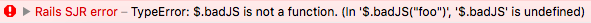

# BetterSJR

[](https://travis-ci.org/carlosramireziii/better_sjr)

BetterSJR improves server-generated JavaScript (SJR) responses in Rails by adding error messages for debugging. 

When enabled, all SJR response templates will be automatically wrapped in a try-catch statement, 
and the error message of any thrown exception will be printed to the console. 

## Requirements

### Ruby and Rails

This gem has been tested against Ruby **>= 2.1** and Rails **>= 4.0**.

## Installation

Add this line to your application's Gemfile:

```ruby
gem 'better_sjr'
```

And then execute:

    $ bundle

Or install it yourself as:

    $ gem install better_sjr

## Usage

Debugging is not enabled by default. 

To enable in development only (recommended), add an initializer and set `debug_sjr`.

```ruby
# config/initializers/better_sjr.rb
BetterSJR.debug_sjr = Rails.env.development?
```

JavaScript runtime errors will now be caught and printed to the browser console instead of failing silently.



## Development

After checking out the repo, run `bin/setup` to install dependencies. Then, run `rake spec` to run the tests. You can also run `bin/console` for an interactive prompt that will allow you to experiment.

To install this gem onto your local machine, run `bundle exec rake install`. To release a new version, update the version number in `version.rb`, and then run `bundle exec rake release`, which will create a git tag for the version, push git commits and tags, and push the `.gem` file to [rubygems.org](https://rubygems.org).

## Contributing

Bug reports and pull requests are welcome on GitHub at https://github.com/carlosramireziii/better_sjr.

## License

The gem is available as open source under the terms of the [MIT License](http://opensource.org/licenses/MIT).
